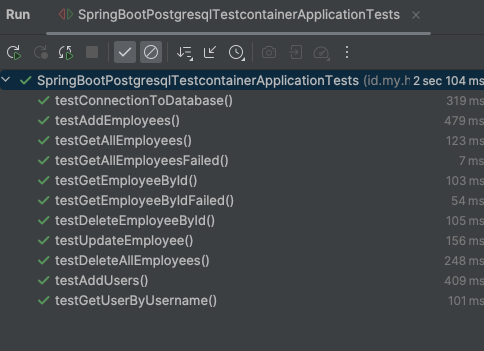

# spring-boot-postgresql-testcontainer

### Things todo list

1. Clone this repository: `git clone https://github.com/hendisantika/spring-boot-postgresql-testcontainer.git`
2. Navigate to the folder: `cd spring-boot-postgresql-testcontainer`
3. Run the application: `mvn clean spring-boot:run`
4. Run the test: `mvn clean test`

